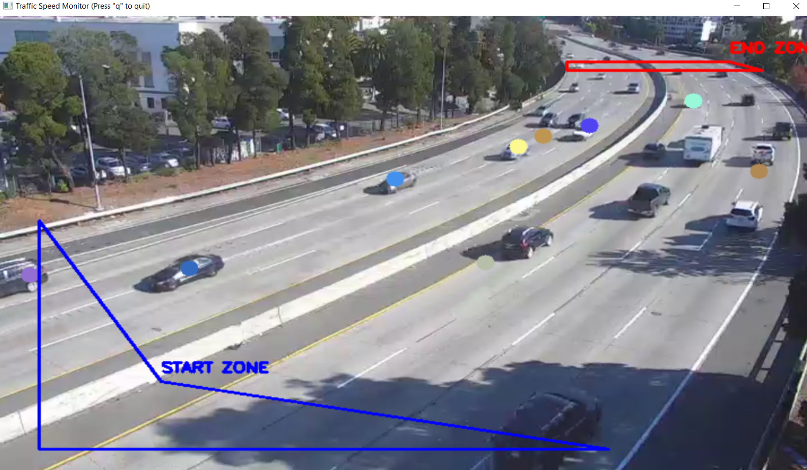

# Traffic Speed Estimator

A Python application to watch a live traffic camera and estimate vehicle speeds using object detection.

HOW TO USE : 

```
pip install opencv-python numpy ultralytics

py main.py
```

## File Structure

main: Runs the main application loop.

config: Holds all settings (camera URL, zones, distance configuration).

video stream: Connects to and reads the video stream.

detection: Detects and tracks vehicles (using Ultralytics YOLO).

ui: Draws detection boxes, tracking dots, and speed estimates on the video feed.

## To-Do / Future Improvements

speed calculation; the distance parameter is wrong

fix detection and tracking stability to reduce dropped tracks

define the center divider and separate tracking for each direction of traffic

improve FPS and reduce stuttering -> could be my laptop

add data collection --> count cars in this stretch, find popular times, find average speed etc. 

## Why?

To apply computer vision and object tracking techniques. 

## Demo Screenshot


as you can see there are some problems but that will change in the future!

Thanks for reading!
